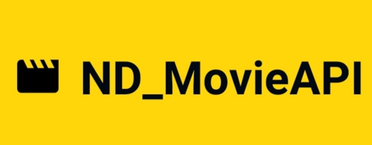

<h1 align="center" style="color: black;">
    
</h1>

---


# 📍 Indíce

- [Sobre](#🔖-sobre)
- [Tecnologias Utilizadas](#🚀-tecnologias-utilizadas)
- [Como instalar o projeto](#🗂-como-instalar-o-projeto)
- [Desenvolvedor](#🧔-Desenvolvedor)

---

## 🔖 Sobre

Aplicação desenvolvida para solução do Desafio da Vaga FullStack Dev Junior. [PDF do Desafio](https://drive.google.com/file/d/1gPqiuzkTp8DGDyZj49rfwkcAgI5whYgw/view?usp=sharing)

---

## 🚀 Tecnologias Utilizadas

O projeto foi desenvolvido utilizando as seguintes tecnologias

- [Node.js](https://nodejs.org/en/)
- [App Mobile](https://github.com/Educolt/newdatamovie)

---

## 🗂 Como instalar o projeto

```bash
  # Clonar o repositório
  $ git clone https://github.com/Educolt/newdatamovieapi

  # Entrar no diretório
  $ cd newdatamovieapi

  # Instalar as dependencias
  $ yarn

  # Inicia o projeto
  $ yarn dev

```

---

### 🧔 Desenvolvedor
Desenvolvido 💜 por Eduardo caldas Coutinho.